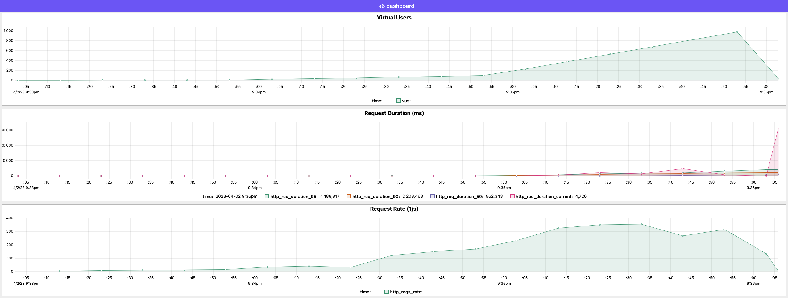
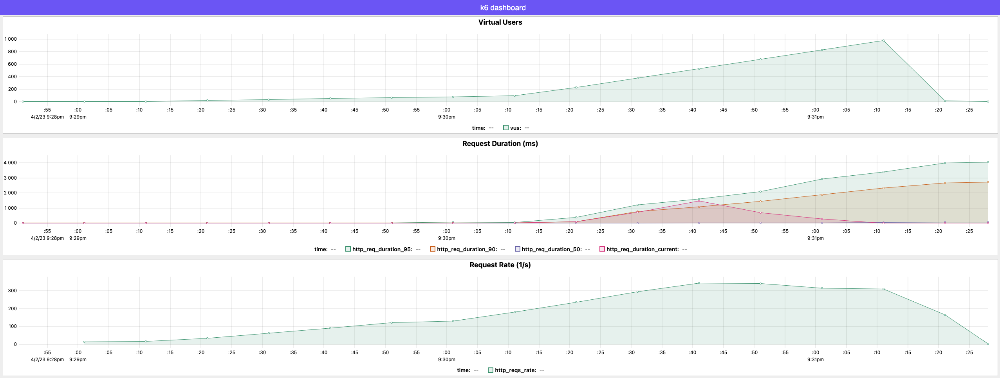

# Репликация в Postgres

1. Проводим нагрузочное тестирование только с одним лишь мастером. В скрипте отправляем запросы на регистрацию пользователя (запись) и получение зарегистрированного по id (чтение).
   

2. Создаем сеть, запоминаем адрес
   docker network create pgnet
   docker network inspect pgnet | grep Subnet

3. Поднимаем мастера

docker run -dit -v $PWD/pgmaster/:/var/lib/postgresql/data -e POSTGRES_PASSWORD=pass -p 5432:5432 --restart=unless-stopped --network=pgnet --name=pgmaster postgres

4. Меняем postgresql.conf на мастере

ssl = off
wal_level = replica
max_wal_senders = 4 # expected slave num

5. Подключаемся к мастеру и создаем пользователя для репликации

docker exec -it pgmaster su - postgres -c psql

create role replicator with login replication password 'pass';

6. Добавляем запись в pg_hba.conf с ip с первого шага

host    replication  replicator  172.16.0.0/16  md5

7. Перезапустим мастера

docker restart pgmaster

8.  Сделаем бэкап для реплик

docker exec -it pgmaster bash

mkdir /pgslave

pg_basebackup -h pgmaster -D /pgslave -U replicator -v -P --wal-method=stream

9. Копируем директорию себе

docker cp pgmaster:/pgslave pgslave

10. Создадим файл, чтобы реплика узнала, что она реплика

touch pgslave/standby.signal

11. Меняем postgresql.conf на реплике

primary_conninfo = 'host=pgmaster port=5432 user=replicator password=pass application_name=pgslave'

12. Запускаем реплику
    docker run -dit -v $PWD/pgslave/:/var/lib/postgresql/data -e POSTGRES_PASSWORD=pass -p 15432:5432 --network=pgnet --restart=unless-stopped --name=pgslave postgres

13. Запустим вторую реплику

docker cp pgmaster:/pgslave pgasyncslave

primary_conninfo = 'host=pgmaster port=5432 user=replicator password=pass application_name=pgasyncslave'

touch pgasyncslave/standby.signal

docker run -dit -v $PWD/pgasyncslave/:/var/lib/postgresql/data -e POSTGRES_PASSWORD=pass -p 25432:5432 --network=pgnet --restart=unless-stopped --name=pgasyncslave postgres

14. Включаем синхронную репликацию

synchronous_commit = on
synchronous_standby_names = 'FIRST 1 (pgslave, pgasyncslave)'

select pg_reload_conf();

15. Создаем схему и пользователя для приложения социальной сети

create user "social-network-user" with password 'social-network-password';
alter user "social-network-user" with superuser;
create database "social_network_otus";

16. Подключаем dbresolver в приложении social_network_otus и регистрируем наш мастер, синхронную и асинхронную реплику
17. Проводим нагрузочное тестирование только с мастером, синхронной и асинхронной репликой. В скрипте отправляем запросы на регистрацию пользователя (запись) и получение зарегистрированного по id (чтение).
   
18. Создаем несколько пользователей с помощью метода POST /user/register и проверяем, что работает метод получения пользователя по id GET /user/{id}
19. Убиваем мастер docker stop pgmaster
20. Пытаемся создать пользователя с помощью метода POST /user/register и получаем ошибку 
```fail to register user: dial tcp 127.0.0.1:5432: connect: connection refused```
21. Пытаемся получить пользователя по id с помощью метода GET /user/{id} и получаем ожидаемый ответ как в пункте 17 
22. Запромоутим реплику pgslave

docker exec -it pgslave su - postgres -c psql

select * from pg_promote();

synchronous_commit = on
synchronous_standby_names = 'ANY 1 (pgmaster, pgasyncslave)'

23. Подключим вторую реплику к новому мастеру

primary_conninfo = 'host=pgslave port=5432 user=replicator password=pass application_name=pgasyncslave'

24. Восстановим мастер в качестве реплики

touch pgmaster/standby.signal

primary_conninfo = 'host=pgslave port=5432 user=replicator password=pass application_name=pgmaster'

25. Меняем порт у мастера и синхронной реплики местами в конфиге сервиса social_network_otus
26. Перезапускаем сервис
27. Создаем несколько пользователей с помощью метода POST /user/register и проверяем, что работает метод получения пользователя по id GET /user/{id}